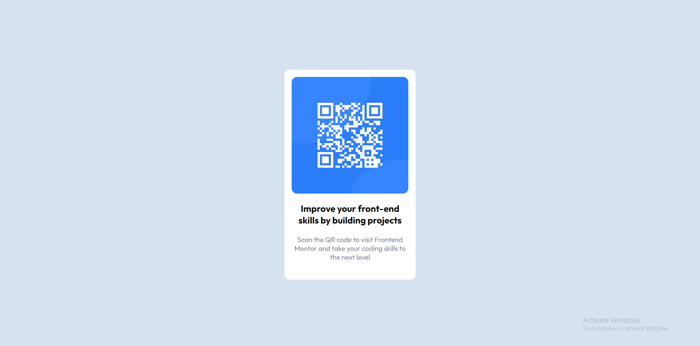

# Frontend Mentor - QR code component solution

This is a solution to the [QR code component challenge on Frontend Mentor](https://www.frontendmentor.io/challenges/qr-code-component-iux_sIO_H). Frontend Mentor challenges help you improve your coding skills by building realistic projects. 

## Table of contents

- [Overview](#overview)
  - [Screenshot](#screenshot)
  - [Links](#links)
- [My process](#my-process)
  - [Built with](#built-with)
  - [What I learned](#what-i-learned)
  - [Continued development](#continued-development)
- [Author](#author)

## Overview

### Screenshot

### Links

- Solution URL: [repository URL here](https://github.com/Akhil-Banothu/FRONTEND-MENTOR-QR-CODE-PROJECT)
- Live Site URL: [live site URL here](https://akhil-banothu.github.io/FRONTEND-MENTOR-QR-CODE-PROJECT/)

## My process

### Built with

- Semantic HTML5 markup
- CSS custom properties
- Flexbox
- CSS Grid
- Mobile-first workflow

### What I learned

I learned how to display the image on the web page and adjust the size of the image. This

I learned how to adjust the element size in different screen sizes including mobile and desktop.

### Continued development

I want to improve more in style and mobile view also.

## Author

- Frontend Mentor - [@Akhil-Banothu](https://www.frontendmentor.io/profile/Akhil-Banothu)

